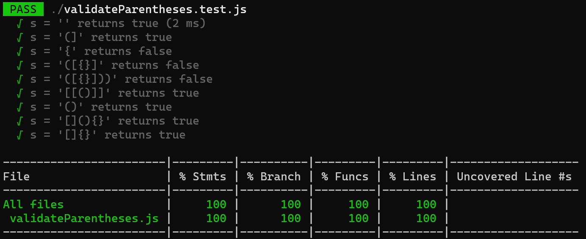
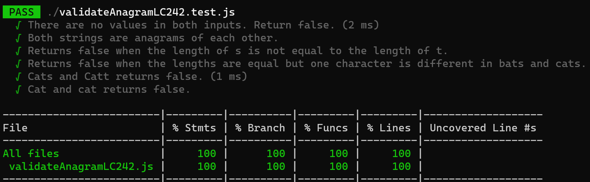

<h1> codeAndTestCollection

## Validate Parentheses LC 20

Determine if the input string is valid.

---

## Validate Anagram LC 242

Given two strings s and t, return true if t is an anagram of s, and false otherwise. 

An anagram is a word or phrase formed by arranging the letters of a different word or phrase, typically using all the original letters exactly once.

---

## Validate Perfect Square LC 367

Given a positive integer num, return true if num is a perfect square or false otherwise.

A perfect square is an integer that is the square of an integer. In other words, it is the product of some integer with itself.
The challenge is to not use any built-in library function, such as sqrt.

