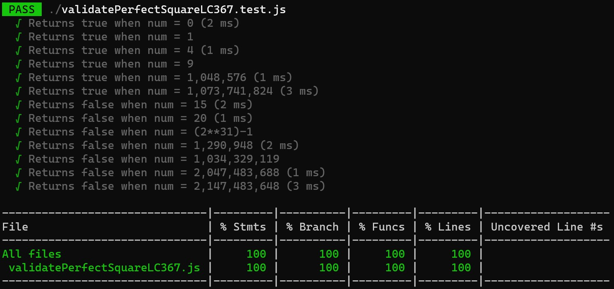

# codeAndTestCollection

This is a collection of Leetcode problems along with unit test for each problem with a 100% coverage.

Here is an example how a coverage report looks like:

- Validate Parentheses LC 20: Determine if the input string is valid.
- Find the Index of the First Occurence in a String LC 28.
- Validate Palindrome LC 125: Validate if the string is a palindrome.
- Remove Linked List Elements LC 203: Remove the matching values from the linked list.
- Validate Anagram LC 242: Given two strings s and t, return true if t is an anagram of s, and false otherwise. 
- First Bad Version LC 278: Find the first bad version in a array. 
- Validate Perfect Square LC 367: Given a positive integer num, return true if num is a perfect square or false otherwise.
- Armstrong Number LC 1134: Given an integer n, return true if and only if it is an Armstrong number. The k-digit number n is an Armstrong number if and only if the kth power of each digit sums to n.
