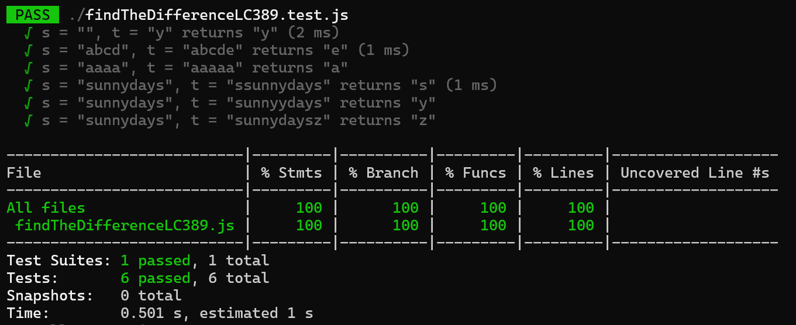

# 389. Find The Difference 

You are given two strings s and t.

String t is generated by random shuffling string s and then add one more letter at a random position.

Return the letter that was added to t.

 