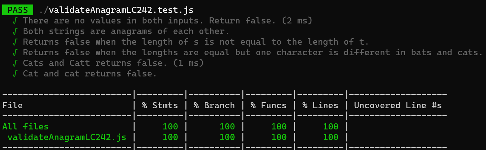

# Validate Anagram LC 242

Given two strings s and t, return true if t is an anagram of s, and false otherwise.

An anagram is a word or phrase formed by arranging the letters of a different word or phrase, typically using all the original letters exactly once.

