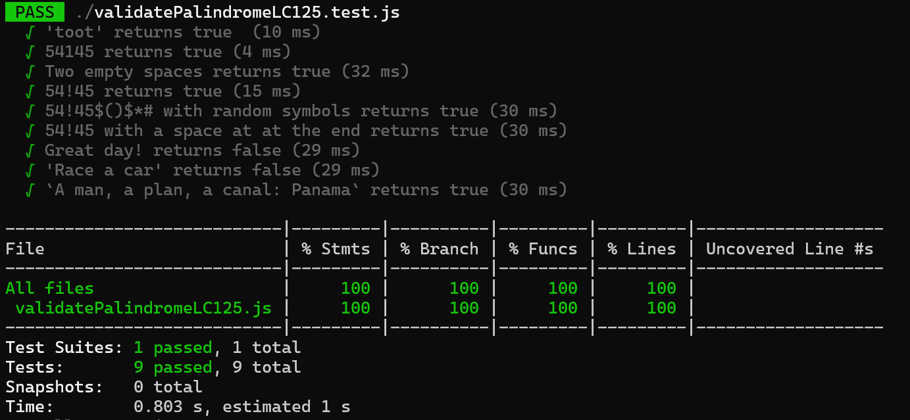

# Validate Palindrome LC 125

A phrase is a *palindrome* if, after converting all uppercase letters into lowercase letters and removing all non-alphanumeric characters, it reads the same forward and backward.

Alphanumeric characters include letters and numbers.

Given a string ```s```, return ```true``` if it is a *palindrome*, or ```false``` otherwise.

<!-- # [Title] LC XX -->

<!-- Given a string s containing just the characters '(', ')', '{', '}', '[' and ']', determine if the input string is valid.

An input string is valid if:

- Open brackets must be closed by the same type of brackets.
- Open brackets must be closed in the correct order.
- Every close bracket has a corresponding open bracket of the same type.
  -->


