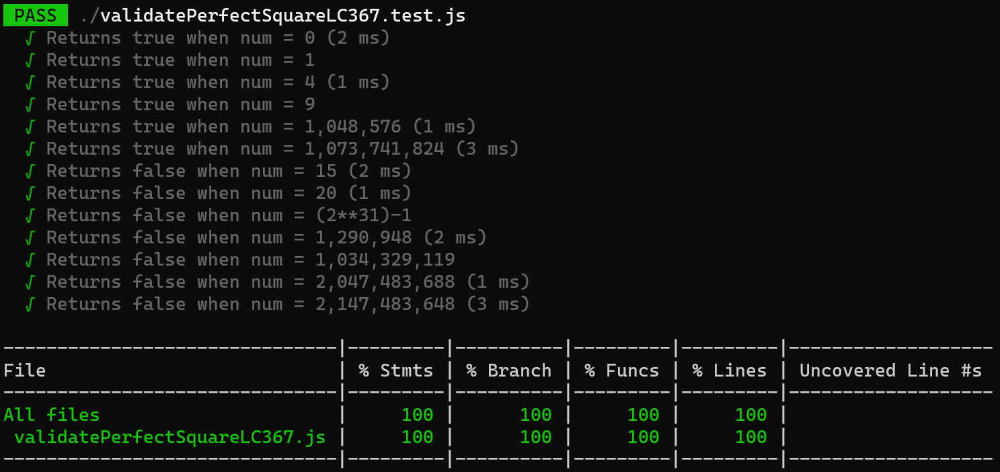

# Validate Perfect Square LC 367

Given a positive integer num, return true if num is a perfect square or false otherwise.

A perfect square is an integer that is the square of an integer. In other words, it is the product of some integer with itself. The challenge is to not use any built-in library function, such as sqrt.

